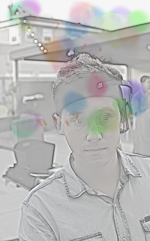
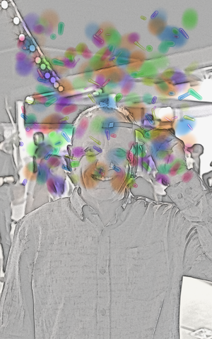
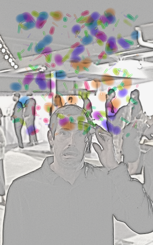
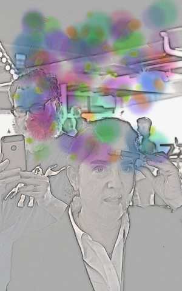
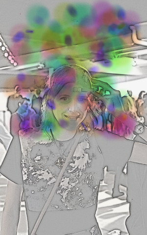
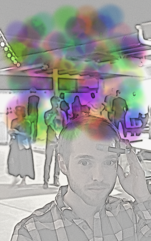
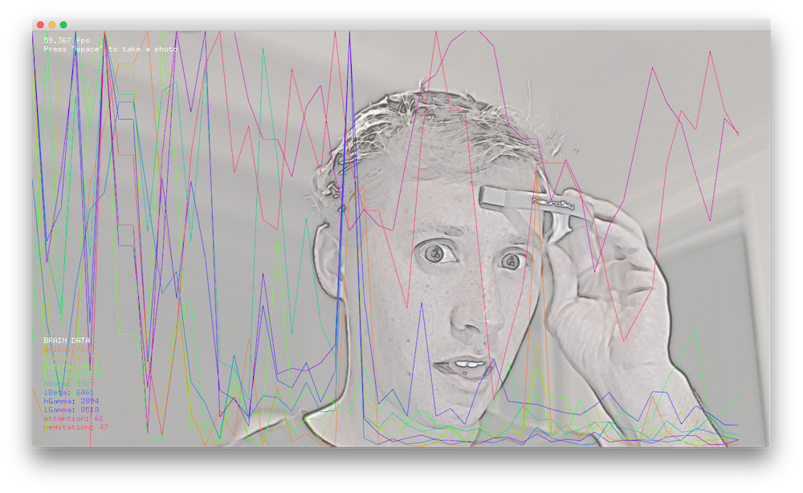

# Creative Thinking (2017)
Brainwaves to illustration. Selfies generated by thought.

## Summary
Creative thinking was an exhibit for a local art show. The project combined the photos of a DSLR camera and recordings from a Mindwave BCI device to create selfies with a unique mental activity imprint. Gamma, Beta, Alpha, Theta, and Delta waves were recorded while participants thought of a memory. During the recording the openframeworks application would capture an image from the DLSR, apply a paper like stencil effect, and then proceed to paint on the brain activity with simulated water colors. Each color corresponded to a different type brain rhythm.

. | Pictures | .
---------| --------- | ---------
 |  | 
 |  | 

[Creative Thinking Video](https://vimeo.com/551763666) - In the video delta waves are mentioned and their association with focus and that isn't correct. Focus is typically more associated with Gamma waves.

## Colors (roughly)
- delta: Deep Orange
- theta: Lime Green
- high Alpha: Highlighter Green
- low Alpha: Aquamarine (green with a hint of blue)
- high Beta: Blue
- low Beta: Purple
- high Gamma: Violet
- low Gamma: Deep Pink

---
## App Structure
[Read](app-structure.md) how the applications components connect to each other, how the effects are applied and the graphics pipeline.

---
### notes on libgphoto2
Ports have a tendency to stay open with Canon 7D. Look for lingering usb port files with `lsof | grep usb` and also in the activity monitor.
Once the port is cleared and you run the application and leave it running it should remain in control of the camera from then on to at least when the app is shutdown.
quick testing out of the app with `gphoto2 --summary` and `gphoto2 --capture-and-download`
